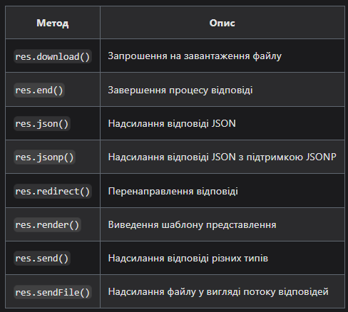

# nodejs-СlassWork-02

xpress - це мінімалістичний та гнучкий веб-фреймворк для програм Node.js, що надає широкий набір функцій для мобільних та веб-додатків. Він має у своєму розпорядженні безліч службових методів HTTP та проміжних обробників, щоб створити надійний API або веб-сайт.

Давайте відразу приступимо до практики. Створіть каталог для своєї програми та зробіть його своїм робочим каталогом.

~~~
$ mkdir myapp
$ cd myapp
$ npm init -y
$ npm install express
~~~

Жива сторінка - http://127.0.0.1:3000/

Додаток видає відповідь “Hello World!” у браузері на запити, адресовані кореневому URL (/) або маршруту. Для всіх інших шляхів відповіддю буде статус 404 - Not Found. Для обробки запитів, маршрутів, у Express визначено ряд вбудованих функцій. Маршрутизація визначає, як ваш додаток відповідає на клієнтський запит до конкретної адреси – URL. Кожен маршрут може мати одну або більше функцій обробки, що виконуються при зіставленні маршруту. Визначення маршруту, згідно з документацією, має таку структуру:

### app.METHOD(PATH, HANDLER)

Де:
*app — це екземпляр express програми.
*METHOD -— метод запиту HTTP (GET, POST, PUT, PATCH, DELETE).
*PATH —- шлях на сервері, у нашому випадку це корінь сайту '/'.
*HANDLER —- функція, що виконується при зіставленні маршруту.

Давайте коротко визначимо для чого використовуються кожен з HTTP дієслів:

GET запитує уявлення ресурсу. Запити з використанням цього методу можуть лише витягувати дані.
POST використовується для надсилання сутностей до певного ресурсу. Часто викликає зміну стану або якісь побічні ефекти на сервері.
PUT замінює всі поточні уявлення ресурсу даними запиту.
DELETE видаляє вказаний ресурс.
PATCH використовується для часткової зміни ресурсу.

Ми ще повернемося до дієслів, коли будемо розглядати створення REST API

## Передача на сервер за допомогою форм.

При надсиланні якихось даних на сервер зазвичай використовуються HTTP методи POST, PUT та PATCH. Це стандартний спосіб при надсиланні форми. Розглянемо як отримувати такі дані в Express.

Формат HTTP повідомлення складається зі списку заголовків та тіла повідомлення. Запит POST від форми стандартно має заголовок Content-Type: application/x-www-form-urlencoded. Насамперед для отримання відправлених даних необхідно підключити парсер через проміжне ПЗ і він уже міститься у фреймворку. Для створення парсера даних від форм застосовується функція urlencoded().:

~~~
app.use(express.urlencoded({ extended: false }));
~~~

У цю функцію передається об'єкт, який визначає параметри парсингу. Значення extended: false вказує, що результат парсингу буде являти собою набір пар ключ-значення, а кожне значення може бути представлене у вигляді рядка чи масиву. Коли цей параметр дорівнює true, парсер використовує іншу бібліотеку для розбору формату рядка.

Нехай ми приймаємо інформацію від форми аутентифікації.

~~~
<form action="/login" method="POST">
  <label for="email">Email</label>
  <input type="text" name="email" id="email" />
  <label for="password">Пароль</label>
  <input type="password" name="password" id="password" />
  <button type="submit">Увійти</button>
</form>
~~~

Браузер відправить на URL <урл нашого додатку>/login дані форми. Це будуть дві змінні: email та password. За це відповідають атрибути name у відповідних тегів input. Ці дані ми повинні прийняти на стороні сервера наступним обробником

~~~
app.post('/login', (req, res, next) => {
  const { email, password } = req.body;
  // Виконуємо необхідні операції
});
~~~

В результаті сервер має отримати дані в об'єкті req.body, наступного виду:

~~~
{
  email: 'Значення, що було введено в поле input',
  password: 'Значення, що було введено в поле input'
}
~~~

При створенні веб-застосунків на Node.js, часто доводиться працювати з даними в JSON форматі. 

~~~
app.use(express.json());
~~~

## Роутінг у додатку

За допомогою класу express.Router можна створювати модульні, монтовані обробники маршрутів. Екземпляр Router є комплексною системою проміжних обробників та маршрутизації; тому його часто називають «міні-додатком».

~~~
const express = require('express');
const router = express.Router();

// визначимо домашній роутер
router.get('/', (req, res) => {
  res.send('Це головний роутер');
});

// визначимо роутер about
router.get('/about', (req, res) => {
  res.send('About');
});

module.exports = router;
~~~

Express підтримує велику кількість методів маршрутизації, що відповідають методам HTTP, але з більшістю ми навіть не матимемо справу, основні методи для нас будуть:

- get
- post
- put
- delete
- patch

Існує також особливий метод маршрутизації, app.all(), не є похідним від будь-якого методу HTTP. Цей метод використовується для завантаження функцій проміжної обробки у дорозі для всіх методів запитів. Він буває корисний коли нам треба реагувати на будь-яке звернення до сервера.
У наведеному нижче прикладі обробник буде запущений для запитів, адресованих /anything, незалежно від того, чи використовується GET, POST, PUT, DELETE або будь-який інший метод запиту HTTP, підтримуваний у модулі http.

~~~
app.all('/anything', (req, res, next) => {
  console.log('Anything method.');
  next(); // передаємо управління далі
});
~~~

### Методи відповіді

Методи в об'єкті відповіді (res), перелічені в таблиці нижче можуть передавати відповідь клієнту та завершувати цикл “запит-відповідь”. Якщо жоден із цих методів не буде викликано з обробника маршруту, клієнтський запит зависне.

## Ланцюжки методів

Метод app.route() дозволяє створювати обробники маршрутів, що утворюють ланцюжки для конкретного шляху маршруту. Оскільки шлях один і той же для різних методів HTTP, зручно створювати модульні маршрути, щоб мінімізувати надмірність та кількість друкарських помилок. Нижче наведено приклад об'єднаних у ланцюжок обробників маршрутів, визначених за допомогою функції app.route().

~~~
app
  .route('/blog')
  .get((req, res) => {
    res.send('Get a list of blog');
  })
  .post((req, res) => {
    res.send('Add a record to blog');
  })
  .put((req, res) => {
    res.send('Update blog');
  });
~~~

# REST API

Express application generator https://expressjs.com/en/starter/generator.html

~~~
npx express-generator --view=ejs simple-express
~~~

npx - утиліта, яка вже є у вас у системі якщо ви встановили Node.js версії вище 8.x, вона дозволяє виконувати команди інших утиліт не встановлюючи їх глобально у системі. Далі ми вказуємо, що хочемо використати шаблон ejs параметром --view=ejs та останнім параметром вказуємо ім'я програми simple-express

